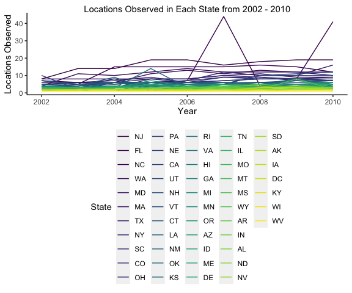
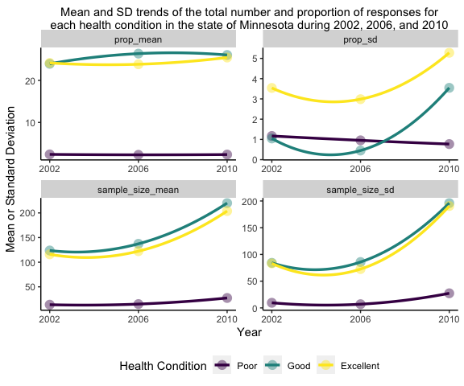

PUBH 7462 Homework 2
================
Jack Rabe
2/9/2022

-   [Problem 3. BRFSS SMART 2002-2010](#problem-3-brfss-smart-2002-2010)
    -   [3.1 Data Exploration and
        Cleaning](#31-data-exploration-and-cleaning)
    -   [3.2 Data Description](#32-data-description)
    -   [3.3 Do Data Science](#33-do-data-science)
        -   [3.3.1 In the year 2004, which states were observed at 6
            locations?](#331-in-the-year-2004-which-states-were-observed-at-6-locations)
        -   [3.3.2 Make a “spaghetti plot” that shows the number of
            observed locations in each state from 2002 to 2010. Which
            state has the highest mean number of locations over this
            period?](#332-make-a-spaghetti-plot-that-shows-the-number-of-observed-locations-in-each-state-from-2002-to-2010-which-state-has-the-highest-mean-number-of-locations-over-this-period)
        -   [3.3.3 Make a table showing, for the years 2002, 2006, and
            2010, the mean and standard deviation of sample size and
            proportion of Excellent, Good, and Poor responses across
            locations in
            MN.](#333-make-a-table-showing-for-the-years-2002-2006-and-2010-the-mean-and-standard-deviation-of-sample-size-and-proportion-of-excellent-good-and-poor-responses-across-locations-in-mn)
        -   [3.3.4 Make stand-alone plot of data from the above
            table](#334-make-stand-alone-plot-of-data-from-the-above-table)

# Problem 3. BRFSS SMART 2002-2010

## 3.1 Data Exploration and Cleaning

``` r
#read data with relative path
brfss.df <- read.csv(file = "./data/brfss_smart_2010.csv", header = TRUE) %>% 
  as_tibble()
```

``` r
#tidy time
tidy_brfss.df <- brfss.df %>% 
  janitor::clean_names() %>%  #clean up variable names
  filter(topic == "Overall Health") %>% #only retain rows where topic is overall health
  separate(col = "locationdesc",
           sep = " - ",
           into = c("state", "county")) %>% #separate column into two distinct variables, "state" and "county"
  select(year, state, county, response, sample_size, data_value) %>% #only retain some of the columns for working with data
  mutate(
    year = as.numeric(year),
    county = str_remove(county, "County"),  #remove county from each data entry
    response = as.factor(response) %>% 
      fct_relevel("Poor", "Fair", "Good", "Very good"), #relevel from alphabetical to poor - excellent scale
  ) %>% 
  rename(health_cond = response,
         prop_response = data_value) %>% 
  arrange(year, state, county, health_cond)

#check that it all looks good
str(tidy_brfss.df)
```

## 3.2 Data Description

*Case definition*: Each observation in the retained **BRFSS** data set
represents the number of responses, within a specific United States
county and over a single year, that rated their health in a certain
category along a scale of “poor” to “excellent.” Each recorded response
comes from adults in the United States who were surveyed over the phone
by the Center for Disease Control and asked how they would rate their
general health condition.

There are 10625 observations in the filtered **BRFSS** data set with 6
variables.

The variables are as follows:

-   *year* of course refers to the year (2002 to 2010) of penguin being
    measured

-   *state* refers to the US state the surveys were conducted in for
    each observation

-   *county* refers to the county the surveys were conducted in

-   *health_cond* refers to the overall health condition (Poor, Fair,
    Good, Very good, Excellent) that people could respond with when
    asked how they would rate their general health

-   *sample_size* refers to the number of responses recorded for a
    specific rating/condition (e.g. excellent) for that US county during
    that year’s survey.

-   *prop_response* refers to the proportion, or more accurately,
    percent of responses that rated themselves as a specific condition
    out of the total number of survey responses.

## 3.3 Do Data Science

### 3.3.1 In the year 2004, which states were observed at 6 locations?

``` r
tidy_brfss.df %>% 
  filter(year == 2004) %>% #filter to only 2004
  group_by(state) %>% 
  summarise(unique_locs = n_distinct(county)) %>% #new variable tallying number of unique county locations observed in each state
  filter(unique_locs == 6) %>% #filter by states that observed 6 unique county locations in 2004
  rename(
    "State" = "state",
    "Locations Observed" = "unique_locs"
  ) %>% 
  gt() %>% 
  tab_header("States that were observed at 6 different locations in 2004")
```

<div id="squavfmfxr" style="overflow-x:auto;overflow-y:auto;width:auto;height:auto;">
<style>html {
  font-family: -apple-system, BlinkMacSystemFont, 'Segoe UI', Roboto, Oxygen, Ubuntu, Cantarell, 'Helvetica Neue', 'Fira Sans', 'Droid Sans', Arial, sans-serif;
}

#squavfmfxr .gt_table {
  display: table;
  border-collapse: collapse;
  margin-left: auto;
  margin-right: auto;
  color: #333333;
  font-size: 16px;
  font-weight: normal;
  font-style: normal;
  background-color: #FFFFFF;
  width: auto;
  border-top-style: solid;
  border-top-width: 2px;
  border-top-color: #A8A8A8;
  border-right-style: none;
  border-right-width: 2px;
  border-right-color: #D3D3D3;
  border-bottom-style: solid;
  border-bottom-width: 2px;
  border-bottom-color: #A8A8A8;
  border-left-style: none;
  border-left-width: 2px;
  border-left-color: #D3D3D3;
}

#squavfmfxr .gt_heading {
  background-color: #FFFFFF;
  text-align: center;
  border-bottom-color: #FFFFFF;
  border-left-style: none;
  border-left-width: 1px;
  border-left-color: #D3D3D3;
  border-right-style: none;
  border-right-width: 1px;
  border-right-color: #D3D3D3;
}

#squavfmfxr .gt_title {
  color: #333333;
  font-size: 125%;
  font-weight: initial;
  padding-top: 4px;
  padding-bottom: 4px;
  border-bottom-color: #FFFFFF;
  border-bottom-width: 0;
}

#squavfmfxr .gt_subtitle {
  color: #333333;
  font-size: 85%;
  font-weight: initial;
  padding-top: 0;
  padding-bottom: 6px;
  border-top-color: #FFFFFF;
  border-top-width: 0;
}

#squavfmfxr .gt_bottom_border {
  border-bottom-style: solid;
  border-bottom-width: 2px;
  border-bottom-color: #D3D3D3;
}

#squavfmfxr .gt_col_headings {
  border-top-style: solid;
  border-top-width: 2px;
  border-top-color: #D3D3D3;
  border-bottom-style: solid;
  border-bottom-width: 2px;
  border-bottom-color: #D3D3D3;
  border-left-style: none;
  border-left-width: 1px;
  border-left-color: #D3D3D3;
  border-right-style: none;
  border-right-width: 1px;
  border-right-color: #D3D3D3;
}

#squavfmfxr .gt_col_heading {
  color: #333333;
  background-color: #FFFFFF;
  font-size: 100%;
  font-weight: normal;
  text-transform: inherit;
  border-left-style: none;
  border-left-width: 1px;
  border-left-color: #D3D3D3;
  border-right-style: none;
  border-right-width: 1px;
  border-right-color: #D3D3D3;
  vertical-align: bottom;
  padding-top: 5px;
  padding-bottom: 6px;
  padding-left: 5px;
  padding-right: 5px;
  overflow-x: hidden;
}

#squavfmfxr .gt_column_spanner_outer {
  color: #333333;
  background-color: #FFFFFF;
  font-size: 100%;
  font-weight: normal;
  text-transform: inherit;
  padding-top: 0;
  padding-bottom: 0;
  padding-left: 4px;
  padding-right: 4px;
}

#squavfmfxr .gt_column_spanner_outer:first-child {
  padding-left: 0;
}

#squavfmfxr .gt_column_spanner_outer:last-child {
  padding-right: 0;
}

#squavfmfxr .gt_column_spanner {
  border-bottom-style: solid;
  border-bottom-width: 2px;
  border-bottom-color: #D3D3D3;
  vertical-align: bottom;
  padding-top: 5px;
  padding-bottom: 5px;
  overflow-x: hidden;
  display: inline-block;
  width: 100%;
}

#squavfmfxr .gt_group_heading {
  padding: 8px;
  color: #333333;
  background-color: #FFFFFF;
  font-size: 100%;
  font-weight: initial;
  text-transform: inherit;
  border-top-style: solid;
  border-top-width: 2px;
  border-top-color: #D3D3D3;
  border-bottom-style: solid;
  border-bottom-width: 2px;
  border-bottom-color: #D3D3D3;
  border-left-style: none;
  border-left-width: 1px;
  border-left-color: #D3D3D3;
  border-right-style: none;
  border-right-width: 1px;
  border-right-color: #D3D3D3;
  vertical-align: middle;
}

#squavfmfxr .gt_empty_group_heading {
  padding: 0.5px;
  color: #333333;
  background-color: #FFFFFF;
  font-size: 100%;
  font-weight: initial;
  border-top-style: solid;
  border-top-width: 2px;
  border-top-color: #D3D3D3;
  border-bottom-style: solid;
  border-bottom-width: 2px;
  border-bottom-color: #D3D3D3;
  vertical-align: middle;
}

#squavfmfxr .gt_from_md > :first-child {
  margin-top: 0;
}

#squavfmfxr .gt_from_md > :last-child {
  margin-bottom: 0;
}

#squavfmfxr .gt_row {
  padding-top: 8px;
  padding-bottom: 8px;
  padding-left: 5px;
  padding-right: 5px;
  margin: 10px;
  border-top-style: solid;
  border-top-width: 1px;
  border-top-color: #D3D3D3;
  border-left-style: none;
  border-left-width: 1px;
  border-left-color: #D3D3D3;
  border-right-style: none;
  border-right-width: 1px;
  border-right-color: #D3D3D3;
  vertical-align: middle;
  overflow-x: hidden;
}

#squavfmfxr .gt_stub {
  color: #333333;
  background-color: #FFFFFF;
  font-size: 100%;
  font-weight: initial;
  text-transform: inherit;
  border-right-style: solid;
  border-right-width: 2px;
  border-right-color: #D3D3D3;
  padding-left: 12px;
}

#squavfmfxr .gt_summary_row {
  color: #333333;
  background-color: #FFFFFF;
  text-transform: inherit;
  padding-top: 8px;
  padding-bottom: 8px;
  padding-left: 5px;
  padding-right: 5px;
}

#squavfmfxr .gt_first_summary_row {
  padding-top: 8px;
  padding-bottom: 8px;
  padding-left: 5px;
  padding-right: 5px;
  border-top-style: solid;
  border-top-width: 2px;
  border-top-color: #D3D3D3;
}

#squavfmfxr .gt_grand_summary_row {
  color: #333333;
  background-color: #FFFFFF;
  text-transform: inherit;
  padding-top: 8px;
  padding-bottom: 8px;
  padding-left: 5px;
  padding-right: 5px;
}

#squavfmfxr .gt_first_grand_summary_row {
  padding-top: 8px;
  padding-bottom: 8px;
  padding-left: 5px;
  padding-right: 5px;
  border-top-style: double;
  border-top-width: 6px;
  border-top-color: #D3D3D3;
}

#squavfmfxr .gt_striped {
  background-color: rgba(128, 128, 128, 0.05);
}

#squavfmfxr .gt_table_body {
  border-top-style: solid;
  border-top-width: 2px;
  border-top-color: #D3D3D3;
  border-bottom-style: solid;
  border-bottom-width: 2px;
  border-bottom-color: #D3D3D3;
}

#squavfmfxr .gt_footnotes {
  color: #333333;
  background-color: #FFFFFF;
  border-bottom-style: none;
  border-bottom-width: 2px;
  border-bottom-color: #D3D3D3;
  border-left-style: none;
  border-left-width: 2px;
  border-left-color: #D3D3D3;
  border-right-style: none;
  border-right-width: 2px;
  border-right-color: #D3D3D3;
}

#squavfmfxr .gt_footnote {
  margin: 0px;
  font-size: 90%;
  padding: 4px;
}

#squavfmfxr .gt_sourcenotes {
  color: #333333;
  background-color: #FFFFFF;
  border-bottom-style: none;
  border-bottom-width: 2px;
  border-bottom-color: #D3D3D3;
  border-left-style: none;
  border-left-width: 2px;
  border-left-color: #D3D3D3;
  border-right-style: none;
  border-right-width: 2px;
  border-right-color: #D3D3D3;
}

#squavfmfxr .gt_sourcenote {
  font-size: 90%;
  padding: 4px;
}

#squavfmfxr .gt_left {
  text-align: left;
}

#squavfmfxr .gt_center {
  text-align: center;
}

#squavfmfxr .gt_right {
  text-align: right;
  font-variant-numeric: tabular-nums;
}

#squavfmfxr .gt_font_normal {
  font-weight: normal;
}

#squavfmfxr .gt_font_bold {
  font-weight: bold;
}

#squavfmfxr .gt_font_italic {
  font-style: italic;
}

#squavfmfxr .gt_super {
  font-size: 65%;
}

#squavfmfxr .gt_footnote_marks {
  font-style: italic;
  font-weight: normal;
  font-size: 65%;
}
</style>
<table class="gt_table">
  <thead class="gt_header">
    <tr>
      <th colspan="2" class="gt_heading gt_title gt_font_normal gt_bottom_border" style>States that were observed at 6 different locations in 2004</th>
    </tr>
    
  </thead>
  <thead class="gt_col_headings">
    <tr>
      <th class="gt_col_heading gt_columns_bottom_border gt_left" rowspan="1" colspan="1">State</th>
      <th class="gt_col_heading gt_columns_bottom_border gt_right" rowspan="1" colspan="1">Locations Observed</th>
    </tr>
  </thead>
  <tbody class="gt_table_body">
    <tr><td class="gt_row gt_left">CO</td>
<td class="gt_row gt_right">6</td></tr>
    <tr><td class="gt_row gt_left">CT</td>
<td class="gt_row gt_right">6</td></tr>
    <tr><td class="gt_row gt_left">MD</td>
<td class="gt_row gt_right">6</td></tr>
    <tr><td class="gt_row gt_left">NM</td>
<td class="gt_row gt_right">6</td></tr>
    <tr><td class="gt_row gt_left">SC</td>
<td class="gt_row gt_right">6</td></tr>
    <tr><td class="gt_row gt_left">TX</td>
<td class="gt_row gt_right">6</td></tr>
    <tr><td class="gt_row gt_left">UT</td>
<td class="gt_row gt_right">6</td></tr>
    <tr><td class="gt_row gt_left">VT</td>
<td class="gt_row gt_right">6</td></tr>
  </tbody>
  
  
</table>
</div>

### 3.3.2 Make a “spaghetti plot” that shows the number of observed locations in each state from 2002 to 2010. Which state has the highest mean number of locations over this period?

``` r
tidy_brfss.df %>% 
  group_by(year, state) %>% 
  summarise(unique_locs = n_distinct(county)) %>% #new variable tallying number of unique county locations observed in each state

  #spaghetti plot of locations observed in each state by year  
  ggplot(aes(x = year, 
             y = unique_locs, 
             color =  fct_reorder(state, unique_locs, .fun = mean, .desc = TRUE)) #highest to lowest mean locs observed
         ) +
  geom_line() +
  scale_color_viridis_d("State") +
  labs(
    x = "Year",
    y = "Locations Observed",
    title = "Locations Observed in Each State from 2002 - 2010"
  )
```

    ## `summarise()` has grouped output by 'year'. You can override using the `.groups` argument.



The state with the highest mean number of locations observed each year
from 2002 - 2010 is New Jersey (NJ) while the lowest is West Virginia
(WV). It appears there may be some connection between mean number of
locations observed in each state with how rural those states are. It
appears that states with low population density tend to have fewer
locations observed than states with higher population density.

For the most part, trends appear to be quite stable over time across all
states with a trend towards gradually increasing the number of locations
observed in each state. This trend has also led to more variability
across states in how many locations were observed each year. For
instance, in 2002 all states recorded fewer than 10 locations observed,
with many recording less than around 6. However, by 2010, that changed
quite a bit, with many states recording more than around 6 locations and
a handful greater than 10 locations. One state even recorded close to 20
locations while another recorded around 40 locations in 2007 and 2010.

### 3.3.3 Make a table showing, for the years 2002, 2006, and 2010, the mean and standard deviation of sample size and proportion of Excellent, Good, and Poor responses across locations in MN.

``` r
tidy_brfss.df %>%
  filter(
    state %in% "MN" &
      year %in% c(2002, 2006, 2010) &
      health_cond %in% c("Poor", "Good", "Excellent")
  ) %>% 
  group_by(year, health_cond) %>%
  summarise(
    sample_size_mean = mean(sample_size, na.rm = TRUE),
    sample_size_sd   = sd(sample_size, na.rm = TRUE),
    prop_mean = mean(prop_response, na.rm = TRUE),
    prop_sd   = sd(prop_response, na.rm = TRUE)
  ) %>% 
  rename(Year = year,
         "Health Condition" = health_cond,
         ) %>% 
  gt() %>% 
  tab_header("Mean and S.D. of the total number and proportion of responses for each health condition in the state of Minnesota during 2002, 2006, and 2010") %>% 
   fmt_number(
     columns = c(sample_size_mean, sample_size_sd, prop_mean, prop_sd),
     decimals = 1)
```

    ## `summarise()` has grouped output by 'year'. You can override using the `.groups` argument.

<div id="afvzwoeney" style="overflow-x:auto;overflow-y:auto;width:auto;height:auto;">
<style>html {
  font-family: -apple-system, BlinkMacSystemFont, 'Segoe UI', Roboto, Oxygen, Ubuntu, Cantarell, 'Helvetica Neue', 'Fira Sans', 'Droid Sans', Arial, sans-serif;
}

#afvzwoeney .gt_table {
  display: table;
  border-collapse: collapse;
  margin-left: auto;
  margin-right: auto;
  color: #333333;
  font-size: 16px;
  font-weight: normal;
  font-style: normal;
  background-color: #FFFFFF;
  width: auto;
  border-top-style: solid;
  border-top-width: 2px;
  border-top-color: #A8A8A8;
  border-right-style: none;
  border-right-width: 2px;
  border-right-color: #D3D3D3;
  border-bottom-style: solid;
  border-bottom-width: 2px;
  border-bottom-color: #A8A8A8;
  border-left-style: none;
  border-left-width: 2px;
  border-left-color: #D3D3D3;
}

#afvzwoeney .gt_heading {
  background-color: #FFFFFF;
  text-align: center;
  border-bottom-color: #FFFFFF;
  border-left-style: none;
  border-left-width: 1px;
  border-left-color: #D3D3D3;
  border-right-style: none;
  border-right-width: 1px;
  border-right-color: #D3D3D3;
}

#afvzwoeney .gt_title {
  color: #333333;
  font-size: 125%;
  font-weight: initial;
  padding-top: 4px;
  padding-bottom: 4px;
  border-bottom-color: #FFFFFF;
  border-bottom-width: 0;
}

#afvzwoeney .gt_subtitle {
  color: #333333;
  font-size: 85%;
  font-weight: initial;
  padding-top: 0;
  padding-bottom: 6px;
  border-top-color: #FFFFFF;
  border-top-width: 0;
}

#afvzwoeney .gt_bottom_border {
  border-bottom-style: solid;
  border-bottom-width: 2px;
  border-bottom-color: #D3D3D3;
}

#afvzwoeney .gt_col_headings {
  border-top-style: solid;
  border-top-width: 2px;
  border-top-color: #D3D3D3;
  border-bottom-style: solid;
  border-bottom-width: 2px;
  border-bottom-color: #D3D3D3;
  border-left-style: none;
  border-left-width: 1px;
  border-left-color: #D3D3D3;
  border-right-style: none;
  border-right-width: 1px;
  border-right-color: #D3D3D3;
}

#afvzwoeney .gt_col_heading {
  color: #333333;
  background-color: #FFFFFF;
  font-size: 100%;
  font-weight: normal;
  text-transform: inherit;
  border-left-style: none;
  border-left-width: 1px;
  border-left-color: #D3D3D3;
  border-right-style: none;
  border-right-width: 1px;
  border-right-color: #D3D3D3;
  vertical-align: bottom;
  padding-top: 5px;
  padding-bottom: 6px;
  padding-left: 5px;
  padding-right: 5px;
  overflow-x: hidden;
}

#afvzwoeney .gt_column_spanner_outer {
  color: #333333;
  background-color: #FFFFFF;
  font-size: 100%;
  font-weight: normal;
  text-transform: inherit;
  padding-top: 0;
  padding-bottom: 0;
  padding-left: 4px;
  padding-right: 4px;
}

#afvzwoeney .gt_column_spanner_outer:first-child {
  padding-left: 0;
}

#afvzwoeney .gt_column_spanner_outer:last-child {
  padding-right: 0;
}

#afvzwoeney .gt_column_spanner {
  border-bottom-style: solid;
  border-bottom-width: 2px;
  border-bottom-color: #D3D3D3;
  vertical-align: bottom;
  padding-top: 5px;
  padding-bottom: 5px;
  overflow-x: hidden;
  display: inline-block;
  width: 100%;
}

#afvzwoeney .gt_group_heading {
  padding: 8px;
  color: #333333;
  background-color: #FFFFFF;
  font-size: 100%;
  font-weight: initial;
  text-transform: inherit;
  border-top-style: solid;
  border-top-width: 2px;
  border-top-color: #D3D3D3;
  border-bottom-style: solid;
  border-bottom-width: 2px;
  border-bottom-color: #D3D3D3;
  border-left-style: none;
  border-left-width: 1px;
  border-left-color: #D3D3D3;
  border-right-style: none;
  border-right-width: 1px;
  border-right-color: #D3D3D3;
  vertical-align: middle;
}

#afvzwoeney .gt_empty_group_heading {
  padding: 0.5px;
  color: #333333;
  background-color: #FFFFFF;
  font-size: 100%;
  font-weight: initial;
  border-top-style: solid;
  border-top-width: 2px;
  border-top-color: #D3D3D3;
  border-bottom-style: solid;
  border-bottom-width: 2px;
  border-bottom-color: #D3D3D3;
  vertical-align: middle;
}

#afvzwoeney .gt_from_md > :first-child {
  margin-top: 0;
}

#afvzwoeney .gt_from_md > :last-child {
  margin-bottom: 0;
}

#afvzwoeney .gt_row {
  padding-top: 8px;
  padding-bottom: 8px;
  padding-left: 5px;
  padding-right: 5px;
  margin: 10px;
  border-top-style: solid;
  border-top-width: 1px;
  border-top-color: #D3D3D3;
  border-left-style: none;
  border-left-width: 1px;
  border-left-color: #D3D3D3;
  border-right-style: none;
  border-right-width: 1px;
  border-right-color: #D3D3D3;
  vertical-align: middle;
  overflow-x: hidden;
}

#afvzwoeney .gt_stub {
  color: #333333;
  background-color: #FFFFFF;
  font-size: 100%;
  font-weight: initial;
  text-transform: inherit;
  border-right-style: solid;
  border-right-width: 2px;
  border-right-color: #D3D3D3;
  padding-left: 12px;
}

#afvzwoeney .gt_summary_row {
  color: #333333;
  background-color: #FFFFFF;
  text-transform: inherit;
  padding-top: 8px;
  padding-bottom: 8px;
  padding-left: 5px;
  padding-right: 5px;
}

#afvzwoeney .gt_first_summary_row {
  padding-top: 8px;
  padding-bottom: 8px;
  padding-left: 5px;
  padding-right: 5px;
  border-top-style: solid;
  border-top-width: 2px;
  border-top-color: #D3D3D3;
}

#afvzwoeney .gt_grand_summary_row {
  color: #333333;
  background-color: #FFFFFF;
  text-transform: inherit;
  padding-top: 8px;
  padding-bottom: 8px;
  padding-left: 5px;
  padding-right: 5px;
}

#afvzwoeney .gt_first_grand_summary_row {
  padding-top: 8px;
  padding-bottom: 8px;
  padding-left: 5px;
  padding-right: 5px;
  border-top-style: double;
  border-top-width: 6px;
  border-top-color: #D3D3D3;
}

#afvzwoeney .gt_striped {
  background-color: rgba(128, 128, 128, 0.05);
}

#afvzwoeney .gt_table_body {
  border-top-style: solid;
  border-top-width: 2px;
  border-top-color: #D3D3D3;
  border-bottom-style: solid;
  border-bottom-width: 2px;
  border-bottom-color: #D3D3D3;
}

#afvzwoeney .gt_footnotes {
  color: #333333;
  background-color: #FFFFFF;
  border-bottom-style: none;
  border-bottom-width: 2px;
  border-bottom-color: #D3D3D3;
  border-left-style: none;
  border-left-width: 2px;
  border-left-color: #D3D3D3;
  border-right-style: none;
  border-right-width: 2px;
  border-right-color: #D3D3D3;
}

#afvzwoeney .gt_footnote {
  margin: 0px;
  font-size: 90%;
  padding: 4px;
}

#afvzwoeney .gt_sourcenotes {
  color: #333333;
  background-color: #FFFFFF;
  border-bottom-style: none;
  border-bottom-width: 2px;
  border-bottom-color: #D3D3D3;
  border-left-style: none;
  border-left-width: 2px;
  border-left-color: #D3D3D3;
  border-right-style: none;
  border-right-width: 2px;
  border-right-color: #D3D3D3;
}

#afvzwoeney .gt_sourcenote {
  font-size: 90%;
  padding: 4px;
}

#afvzwoeney .gt_left {
  text-align: left;
}

#afvzwoeney .gt_center {
  text-align: center;
}

#afvzwoeney .gt_right {
  text-align: right;
  font-variant-numeric: tabular-nums;
}

#afvzwoeney .gt_font_normal {
  font-weight: normal;
}

#afvzwoeney .gt_font_bold {
  font-weight: bold;
}

#afvzwoeney .gt_font_italic {
  font-style: italic;
}

#afvzwoeney .gt_super {
  font-size: 65%;
}

#afvzwoeney .gt_footnote_marks {
  font-style: italic;
  font-weight: normal;
  font-size: 65%;
}
</style>
<table class="gt_table">
  <thead class="gt_header">
    <tr>
      <th colspan="5" class="gt_heading gt_title gt_font_normal gt_bottom_border" style>Mean and S.D. of the total number and proportion of responses for each health condition in the state of Minnesota during 2002, 2006, and 2010</th>
    </tr>
    
  </thead>
  <thead class="gt_col_headings">
    <tr>
      <th class="gt_col_heading gt_columns_bottom_border gt_center" rowspan="1" colspan="1">Health Condition</th>
      <th class="gt_col_heading gt_columns_bottom_border gt_right" rowspan="1" colspan="1">sample_size_mean</th>
      <th class="gt_col_heading gt_columns_bottom_border gt_right" rowspan="1" colspan="1">sample_size_sd</th>
      <th class="gt_col_heading gt_columns_bottom_border gt_right" rowspan="1" colspan="1">prop_mean</th>
      <th class="gt_col_heading gt_columns_bottom_border gt_right" rowspan="1" colspan="1">prop_sd</th>
    </tr>
  </thead>
  <tbody class="gt_table_body">
    <tr class="gt_group_heading_row">
      <td colspan="5" class="gt_group_heading">2002</td>
    </tr>
    <tr><td class="gt_row gt_center">Poor</td>
<td class="gt_row gt_right">13.8</td>
<td class="gt_row gt_right">9.6</td>
<td class="gt_row gt_right">2.4</td>
<td class="gt_row gt_right">1.2</td></tr>
    <tr><td class="gt_row gt_center">Good</td>
<td class="gt_row gt_right">123.8</td>
<td class="gt_row gt_right">84.3</td>
<td class="gt_row gt_right">23.9</td>
<td class="gt_row gt_right">1.0</td></tr>
    <tr><td class="gt_row gt_center">Excellent</td>
<td class="gt_row gt_right">116.0</td>
<td class="gt_row gt_right">83.3</td>
<td class="gt_row gt_right">24.1</td>
<td class="gt_row gt_right">3.5</td></tr>
    <tr class="gt_group_heading_row">
      <td colspan="5" class="gt_group_heading">2006</td>
    </tr>
    <tr><td class="gt_row gt_center">Poor</td>
<td class="gt_row gt_right">15.0</td>
<td class="gt_row gt_right">6.9</td>
<td class="gt_row gt_right">2.3</td>
<td class="gt_row gt_right">1.0</td></tr>
    <tr><td class="gt_row gt_center">Good</td>
<td class="gt_row gt_right">137.3</td>
<td class="gt_row gt_right">85.8</td>
<td class="gt_row gt_right">26.4</td>
<td class="gt_row gt_right">0.5</td></tr>
    <tr><td class="gt_row gt_center">Excellent</td>
<td class="gt_row gt_right">122.3</td>
<td class="gt_row gt_right">72.6</td>
<td class="gt_row gt_right">23.8</td>
<td class="gt_row gt_right">3.0</td></tr>
    <tr class="gt_group_heading_row">
      <td colspan="5" class="gt_group_heading">2010</td>
    </tr>
    <tr><td class="gt_row gt_center">Poor</td>
<td class="gt_row gt_right">27.4</td>
<td class="gt_row gt_right">27.3</td>
<td class="gt_row gt_right">2.4</td>
<td class="gt_row gt_right">0.8</td></tr>
    <tr><td class="gt_row gt_center">Good</td>
<td class="gt_row gt_right">220.0</td>
<td class="gt_row gt_right">196.1</td>
<td class="gt_row gt_right">26.0</td>
<td class="gt_row gt_right">3.5</td></tr>
    <tr><td class="gt_row gt_center">Excellent</td>
<td class="gt_row gt_right">203.8</td>
<td class="gt_row gt_right">190.6</td>
<td class="gt_row gt_right">25.4</td>
<td class="gt_row gt_right">5.3</td></tr>
  </tbody>
  
  
</table>
</div>

From a quick look at this table, it appears that the mean number of
adults surveyed about their general health steadily increases from year
to year. In other words, the number of responses for each health
condition seem to rise across the board over time. As would be expected
with an increase in the mean, the variability (standard deviation) in
responses by health condition also appears to increase over time in
Minnesota.

On the other hand, it doesn’t appear that the proportion of responses
for overall condition of health (peoples perception of how healthy they
are) changes significantly over time and seem quite stable. The
variability (standard deviation), especially for people responding with
good or excellent overall health, seems to fluctuate quite a bit, with
the sd for good and excellent increasing over time.

### 3.3.4 Make stand-alone plot of data from the above table

``` r
tidy_brfss.df %>%
  filter(
    state %in% "MN" &
      year %in% c(2002, 2006, 2010) &
      health_cond %in% c("Poor", "Good", "Excellent")
  ) %>% 
  group_by(year, health_cond) %>%
  summarise(
    sample_size_mean = mean(sample_size, na.rm = TRUE),
    sample_size_sd   = sd(sample_size, na.rm = TRUE),
    prop_mean = mean(prop_response, na.rm = TRUE),
    prop_sd   = sd(prop_response, na.rm = TRUE)
  ) %>% 
  pivot_longer(cols = contains(c("mean", "sd")), #taking time from wide to long
               names_to = "stat_type",  
               values_to = "stat_value"
               ) %>% 

#now make the appropriate plot
ggplot(aes(x = year, y = stat_value, color = health_cond)) +
    geom_point(size = 4, alpha = 0.44, shape = 16) +
    stat_smooth(alpha = 0.1, 
              size = 1.2, 
              method = "loess",
              span = 2,
              se = FALSE) +
  labs(
    x = "Year",
    y = "Mean or Standard Deviation",
    title = "Mean and SD trends of the total number and proportion of responses for\neach health condition in the state of Minnesota during 2002, 2006, and 2010"
  ) +
  scale_colour_viridis_d("Health Condition") + 
  facet_wrap(~ stat_type, scales = "free", ncol = 2) + 
  scale_x_continuous(breaks = c(2002, 2006, 2010))
```



Here we can see the same trends that I stated above with regard to the
table version. However, visualizing the results in this way allows you
to really see the differences and pick up any small nuances that might
not be significant. For instance, we see again that the mean number of
responses for each health condition rises considerably over time. By
plotting, we can better see the magnitude of such changes, where the
mean and sd of total responses rises much faster between 2006 and 2010
and for people saying they’re in good or excellent condition. Between
2002 and 2006 and for people responding as having poor health, this rise
is more gradual.

In terms of proportion of responses for each health condition, we see
that the mean changes little to none across all three categories, aside
from 2006 where good and excellent diverge slightly. However, even
though the mean proportions don’t change much, that’s not the case for
the standard deviation, where it rises considerably for those responding
as having good or excellent health, particiularly from 2006 to 2010.
There is also a rise for people resonding with poor health but it is not
as pronounced.
